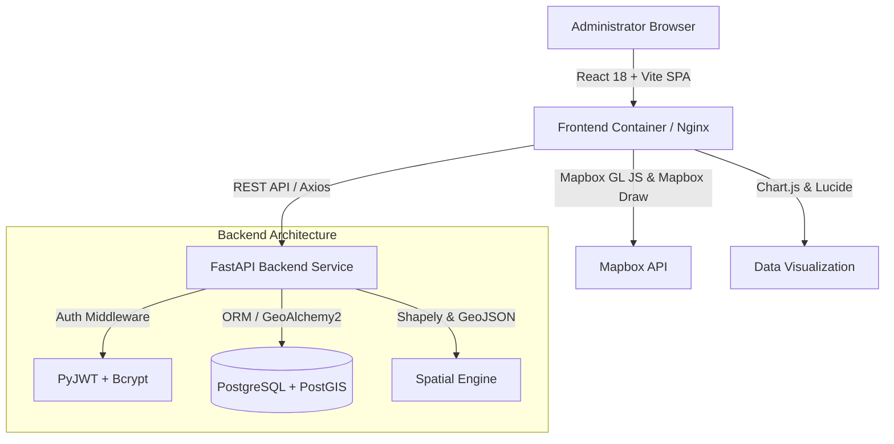
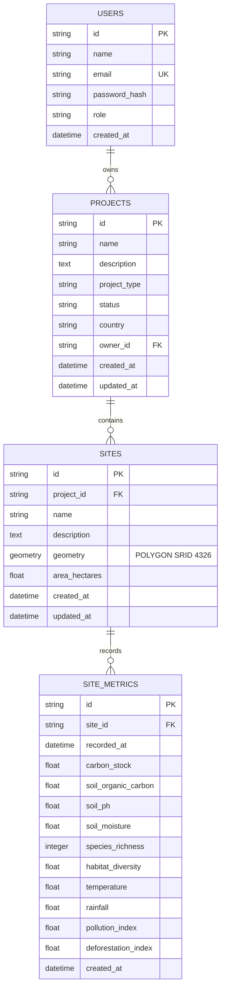

# Darukaa.Earth – Carbon & Biodiversity Project Intelligence Platform

> **Full-Stack Developer Assessment Submission for Darukaa.Earth**

Darukaa.Earth is a full-stack, enterprise-grade geospatial analytics and environmental intelligence dashboard designed for managing Carbon & Biodiversity projects, geographical sites, spatial polygon boundaries, and historical time-series metrics.

---

## 🌟 Key Features & Core User Stories

- 🔐 **JWT Authentication & Security**: Complete registration, login, session persistence, password hashing (`bcrypt`), and protected routes.
- 📁 **Project Management (CRUD)**: Administrator interface for creating, filtering, searching, editing, and deleting Carbon, Biodiversity, and Mixed projects.
- 🗺️ **PostGIS Geospatial Engine**: Storing site spatial boundaries as native PostGIS `POLYGON` geometries (SRID 4326) with automated area calculations in hectares.
- ✏️ **Interactive Polygon Drawing**: Mapbox GL Draw integration enabling administrators to draw site boundaries directly on an interactive map to add new geographical sites.
- 📊 **Time-Series Analytics & Data Visualization**: Responsive Chart.js interactive graphs tracking Carbon Stock, Soil Organic Carbon (SOC), Species Richness, Soil Moisture, and Rainfall trends over time.
- ⚡ **CI/CD & Developer Experience**: Automated GitHub Actions CI workflow, pre-commit hooks (Ruff, Black, ESLint, Prettier), and Docker Compose orchestration.

---

## 🏗️ High-Level System Architecture



---

## 🛠️ Technology Stack & Rationale

| Layer | Technology | Engineering Rationale |
| :--- | :--- | :--- |
| **Frontend Framework** | React 18, TypeScript, Vite | Lightning-fast HMR, type safety, lightweight bundle, efficient DOM rendering. |
| **Mapping Library** | Mapbox GL JS, Mapbox GL Draw | Industry gold-standard vector map renderer with interactive polygon drawing tools. |
| **Data Visualization** | Chart.js, react-chartjs-2 | Canvas-rendered, high-performance time-series charting with tooltips & responsive scaling. |
| **Styling & UI** | Tailwind CSS, Lucide Icons | Utility-first responsive design, dark environmental color palette, zero CSS bloat. |
| **Backend Framework** | Python 3.12, FastAPI, Pydantic v2 | High async performance, automatic OpenAPI documentation, strict schema validation. |
| **Database & GIS** | PostgreSQL 16, PostGIS 3.4 | Gold standard for enterprise geospatial query execution, spatial indexes, and `POLYGON` geometry types. |
| **ORM & Migrations** | SQLAlchemy 2.0, GeoAlchemy2, Alembic | Declarative mapping for spatial objects, structured database migrations. |
| **Authentication** | PyJWT, Passlib (bcrypt) | Stateless bearer token authentication with secure salted password hashing. |
| **DevOps & Quality** | Docker Compose, GitHub Actions, Ruff, ESLint | Consistent containerized setup, automated code formatting, and pre-commit verification. |

---

## 🗄️ Database Schema

The database relies on PostgreSQL with the **PostGIS** extension (`CREATE EXTENSION IF NOT EXISTS postgis;`).



---

## 🔑 Demo Credentials

A seed script automatically creates an administrator account and synthetic ecological dataset upon launch:

- **Email**: `demo@darukaa.earth`
- **Password**: `Demo@12345`

*Note: All environmental metrics and historical trend records generated by the seed script are synthetic mock data for demonstration purposes.*

---

## 🚀 Quickstart & Local Setup

### Option 1: Docker Compose (Recommended)

1. **Clone Repository**:
   ```bash
   git clone https://github.com/your-org/darukaa-earth.git
   cd darukaa-earth
   ```

2. **Configure Environment Variables**:
   Copy `.env.example` to `.env` and set your Mapbox token:
   ```bash
   cp .env.example .env
   ```

3. **Start All Services**:
   ```bash
   docker-compose up --build
   ```

4. **Access Applications**:
   - **Frontend App**: `http://localhost:5173`
   - **Backend API Docs**: `http://localhost:8000/api/docs`

---

### Option 2: Local Manual Setup

#### Backend Setup (Python 3.12)
1. **Navigate & create virtualenv**:
   ```bash
   cd backend
   python -m venv .venv
   source .venv/bin/activate  # On Windows: .venv\Scripts\activate
   ```
2. **Install dependencies**:
   ```bash
   pip install -r requirements.txt
   ```
3. **Run Database Migrations & Seed Data**:
   ```bash
   alembic upgrade head
   python seed.py
   ```
4. **Launch FastAPI Server**:
   ```bash
   uvicorn app.main:app --reload --port 8000
   ```

#### Frontend Setup (Node.js 20)
1. **Navigate & install dependencies**:
   ```bash
   cd frontend
   npm install
   ```
2. **Start Vite Dev Server**:
   ```bash
   npm run dev
   ```

---

## 🧪 Testing & Code Quality

### Backend Tests & Linting
```bash
cd backend
# Run unit & integration test suite
pytest -v

# Run code quality checks
ruff check .
black --check .
```

### Frontend Linting & Build Verification
```bash
cd frontend
# Run ESLint checks
npm run lint

# Run TypeScript type check & build
npm run build
```

---

## 🔄 CI/CD Pipeline (GitHub Actions)

The repository contains an automated GitHub Actions pipeline (`.github/workflows/ci.yml`) configured to execute on every `push` and `pull_request`:

1. **Backend Job**:
   - Boots up PostGIS PostgreSQL service container (`postgis/postgis:16-3.4`).
   - Runs `ruff` and `black` code formatters.
   - Executes Alembic migrations and Pytest test suite.
2. **Frontend Job**:
   - Sets up Node.js 20 environment.
   - Installs dependencies.
   - Runs ESLint.
   - Verifies TypeScript compiler strictness & creates production build bundle.

---

## 🌐 Public Deployment Configuration

- **Backend**: Deployable to **Render.com** / **Railway** using the included `Dockerfile` and PostgreSQL + PostGIS database add-on.
- **Frontend**: Deployable to **Vercel** / **Netlify** / **Render** static sites. Set `VITE_API_BASE_URL` to point to the deployed backend URL and `VITE_MAPBOX_TOKEN` to your Mapbox token.

---

## ⚖️ Trade-offs & Engineering Decisions

1. **Synthetic Environmental Metrics**: Synthetic mock data was generated to allow immediate visualization of Chart.js time-series graphs without requiring third-party satellite satellite API subscriptions.
2. **PostGIS Polygon Calculations**: Spatial area in hectares is computed directly using PostGIS `ST_Area(geometry::geography)` for maximum accuracy in geodesic space (WGS84).
3. **Mapbox Token Fallback**: If `VITE_MAPBOX_TOKEN` is missing in local development, the application presents a configuration banner while keeping all dashboard, table, and project features fully functional.

---

## 📩 Reviewer Access / Contact

If the repository is private, access has been granted to the hiring team:
- `ankita.dasgupta@darukaa.earth`
- `harsh.kumar@darukaa.earth`
- `utkarsh.gauniyal@darukaa.earth`
- `guneet.mutreja@darukaa.earth`
